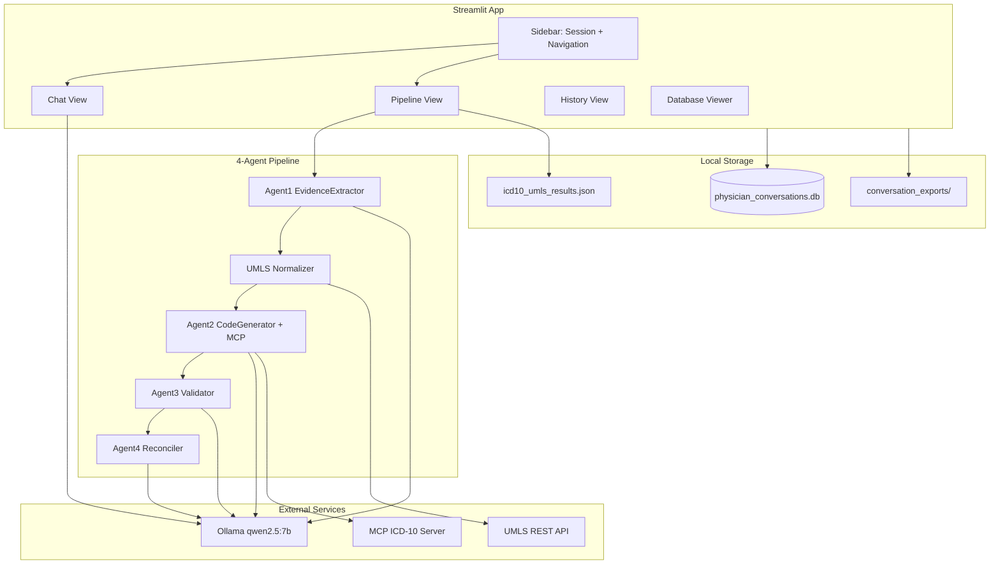

# AI Agents for Clinical Coding

A local-first physician assistant for ICD-10 clinical coding. The system combines a 4-agent LLM pipeline with UMLS term normalization, MCP-grounded ICD-10 lookup, Ollama inference, and SQLite conversation memory — all running on your machine.

## Overview

Physicians paste clinical notes and receive verified ICD-10 code assignments with sequencing, validation flags, and claim-ready status. A separate chat mode provides quick clinical Q&A. All patient data stays local.

## Architecture



## Prerequisites

- **Python 3.10+**
- **[Ollama](https://ollama.com/)** with `qwen2.5:7b` pulled (`ollama pull qwen2.5:7b`)
- **[Node.js](https://nodejs.org/)** — required for the MCP ICD-10 server (`npx @findicd10/mcp`)
- **UMLS API key** (optional) — free at [https://uts.nlm.nih.gov](https://uts.nlm.nih.gov)

## Installation

```bash
pip install streamlit requests pandas
```

## Configuration

| Setting | Location | Default |
|---------|----------|---------|
| `OLLAMA_URL` | `app.py`, `icd10_pipeline_with_umls.py` | `http://localhost:11434/api/generate` |
| `MODEL` | same | `qwen2.5:7b` |
| `UMLS_API_KEY` | same, or enter in Pipeline view | `YOUR_UMLS_API_KEY_HERE` |
| `DB_PATH` | `conversation_memory.py` | `physician_conversations.db` |
| `EXPORT_FOLDER` | `conversation_memory.py` | `conversation_exports/` |

Set your UMLS key in `icd10_pipeline_with_umls.py` or enter it in the Pipeline view at runtime. If the key is the placeholder value, UMLS normalization is skipped.

## Running the App

```bash
# Start Ollama (if not already running)
ollama serve

# Launch the Streamlit UI
streamlit run app.py
```

## Physician Workflow

1. **Start a session** — Enter Patient ID and Physician in the sidebar, then click **Start / Resume**.
2. **Chat** — Ask clinical questions via Ollama. This is general Q&A, not verified coding.
3. **ICD-10 Pipeline** — Paste a clinical note and run the full 4-agent pipeline for verified code extraction.
4. **Session History** — Review past sessions, assigned codes, and message previews for the current patient.
5. **Database Viewer** — Browse raw SQLite tables, filter records, and export CSV.
6. **Export** — Download session or patient history as `.txt` from the sidebar.

## Pipeline Stages

| Stage | Function | Role |
|-------|----------|------|
| **Agent 1** | `agent_evidence_extractor` | Extracts diagnoses, symptoms, and findings from the clinical note with certainty levels |
| **Stage 1.5** | `UMLSNormalizer` | Maps clinical shorthand to canonical terms, CUIs, synonyms, and ICD-10/SNOMED crosswalks |
| **Agent 2** | `agent_code_candidate_generator` | Uses the MCP ICD-10 server for verified code lookup; Qwen selects the best candidate per finding |
| **Agent 3** | `agent_validator` | Audits codes against ICD-10-CM guidelines; flags exclusions, missing codes, and physician queries |
| **Agent 4** | `agent_reconciler` | Sequences final codes (PRIMARY/SECONDARY/COMPLICATION), sets `claim_ready`, and produces a billing summary |

**Orchestrator:** `run_pipeline(clinical_note, umls_api_key)` in `icd10_pipeline_with_umls.py`

**Output:** Structured JSON written to `icd10_umls_results.json`, displayed in the UI, and persisted to SQLite.

## Project Files

| File | Role |
|------|------|
| `app.py` | Streamlit UI — chat, pipeline, history, database viewer |
| `icd10_pipeline_with_umls.py` | 4-agent pipeline, UMLS normalizer, MCP client |
| `conversation_memory.py` | SQLite session and message persistence, export utilities |

## Data & Privacy

All LLM inference runs locally via Ollama. No patient data is sent to external LLM APIs.

**SQLite schema:**

- **`sessions`** — `session_id`, `patient_id`, `physician_id`, timestamps, `note_context`, `icd10_codes` (JSON), `diagnoses` (JSON), `status`
- **`messages`** — `id`, `session_id`, `patient_id`, `timestamp`, `role`, `content`, `message_type`

**Runtime artifacts** (created on first use):

- `physician_conversations.db` — conversation database
- `icd10_umls_results.json` — last pipeline run output
- `conversation_exports/` — exported `.txt` and `.csv` files

UMLS API calls are made only when a valid API key is provided (terminology normalization).

## CLI Usage

Run the pipeline standalone with a sample clinical note:

```bash
python icd10_pipeline_with_umls.py
```

Demo the memory module:

```bash
python conversation_memory.py
```

## Known Limitations

- **MCP spawn** uses Windows-style `cmd /c` in `ICD10MCPClient` — may need adjustment on macOS/Linux (`["npx", "-y", "@findicd10/mcp"]`).
- **Chat mode** does not run the verified pipeline — use the Pipeline view for claim-ready coding.
- **UMLS normalization** is skipped when the API key is the placeholder value.
- **Chat history** is rebuilt from session state, not from `load_session_for_prompt()` truncation.

## References

- Corti — Code Like Humans (CLH), EMNLP 2025
- DR.KNOWS — JMIR AI 2025
- PLM-ICD + Qwen2.5 hybrid, Preprints.org 2025
- Benchmarking LLMs for ICD-10, MedRxiv 2024
